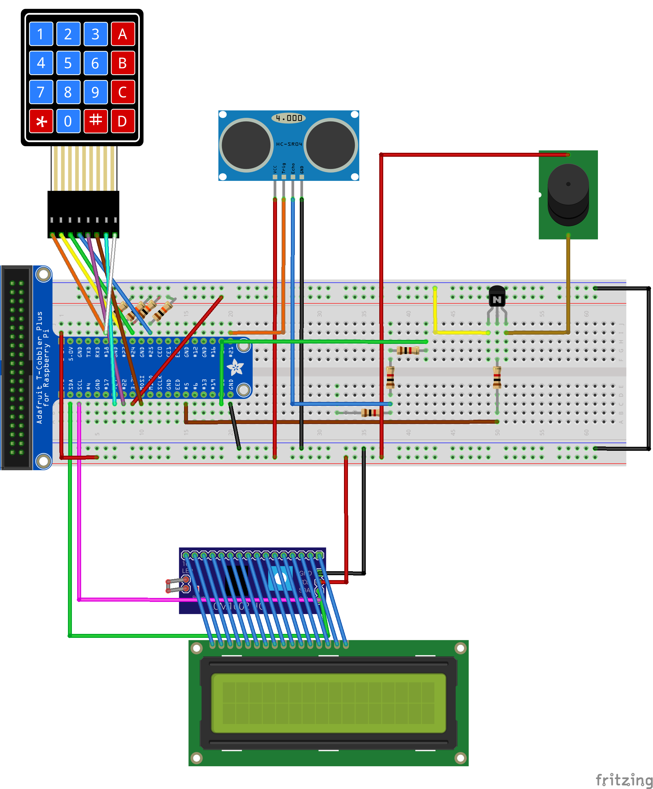

# Burglar Alarm
Burglar Alarm is a demo-lunchbox burglar alarm. The idea came from the book _Dear Mr. Henshaw_ by Beverly Cleary. This burglar alarm uses a Ultrasonic Distance Sensor to detect a person opening the lunchbox.


## Making Burglar Alarm
_For more details, visit [guide (PDF)](./docs/RyanKim_BurglarAlarm.pdf) for more details about wiring the circuits. Check heading **Images** in [guide (PDF)](./docs/RyanKim_BurglarAlarm.pdf) to see how parts look like._

## Needed Parts
You'll need:
* 1 Ultrasonic Distance Sensor
* 1 Adafruit LCD I2C Backpack
* 1 AdafruitCharLCD
* 1 MatrixKeypad
* 1 Breadboard
* 1 Adafruit T-Cobbler Plus for Raspberry Pi
* 1 Raspberry Pi 4
  * RAM: 4GB
* 1 SD CARD
  * Min. Storage: 16GB
  * Recommended Storage: 64GB or more
* 3 1kΩ resistors
* 4 10kΩ resistors
* 1 Phone Battery
* 1 USB-C Cable
* 1 Desktop with SSH (Windows, Mac, Linux, Chrome, and etc.)
* 1 Buzzer
* 1 NPM Transitor

## Wiring
Wire it like this:

_If there is a issue in the circuit diagram, add an issue in GitHub._

## Running Burglar Alarm
Download SMBUS for Python and enable I2C. Reboot.
Open a new terminal. It should say:
```
pi@raspberrypi:~ $
```

Type:
```
$ git clone https://github.com/ryankim5/burglar-alarm/
```

Next, type:
```
$ nano /etc/rc.local
```

It should open the Nano editor. Go to the second-to-the-last line, and type:
```
python3 /home/pi/burglar-alarm/run.py
```
(Just before `exit 0`)

Reboot your Pi by typing `sudo reboot`. Your Burglar Alarm should turn on.

Put it in your lunchbox, make the distance sensor face the cover of your lunchbox, power it by the phone battery, and you are done!


## How to Use the Burglar Alarm
Reference [guide (PDF)](./docs/RyanKim_BurglarAlarm.pdf).
